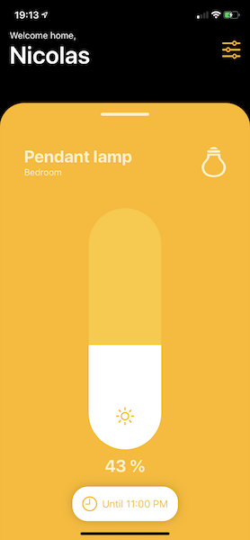

# AutomationLight

SwiftUI Sample for a Smart home application.

Weekend UI challenge proposed by [iam_iosdev](https://www.instagram.com/iam_iosdev/) and designed by [nicolas.dsgn](https://www.instagram.com/nicolas.dsgn/)

## Features used:

- DragGesture

## Screenshots

- Dark mode: 

- Light mode: 

